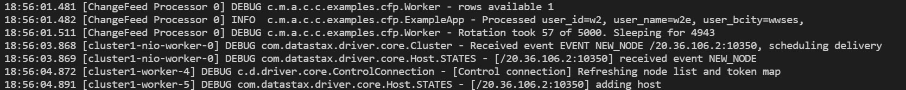

# Using FeedRanges to parallelise processing of change feed in Cosmos DB Cassandra API
Azure Cosmos DB is a globally distributed multi-model database. One of the supported APIs is the Cassandra API. This sample illustrates how to use FeedRanges in Cassandra API to parallelise processing when reading from Azure Cosmos DB's change feed.

**Note**: FeedRanges support for Cassandra API is currently in *private preview*. Please reach out to Microsoft to have this feature enabled for your Cosmos DB account. 

## Prerequisites
* Before you can run this sample, you must have the following prerequisites:
    * An active Azure Cassandra API account - If you don't have an account, refer to the [Create Cassandra API account](https://aka.ms/cassapijavaqs). 
    * [Java Development Kit (JDK) 1.8+](http://www.oracle.com/technetwork/java/javase/downloads/jdk8-downloads-2133151.html)
        * On Ubuntu, run `apt-get install default-jdk` to install the JDK.
    * Be sure to set the JAVA_HOME environment variable to point to the folder where the JDK is installed.
    * [Download](http://maven.apache.org/download.cgi) and [install](http://maven.apache.org/install.html) a [Maven](http://maven.apache.org/) binary archive
        * On Ubuntu, you can run `apt-get install maven` to install Maven.
    * [Git](https://www.git-scm.com/)
        * On Ubuntu, you can run `sudo apt-get install git` to install Git.

## Running this sample
1. Clone this repository using `git clone git@github.com:Azure-Samples/cosmosdb-cassandra-changefeed-processor.git cosmosdb`.

1. Change directories to the repo using `cd cosmosdb`

1. Next, update credentials the file `src/main/resources/reference.conf` (you can get the values from "connection string" tab in Azure portal):

    ```conf
        cassandra {
            port = 10350
            host = "<ACCOUNT NAME>.cassandra.cosmos.azure.com"
            username = "<ACCOUNT NAME>"
            password = "<PRIMARY PASSWORD>"
        }
        
        ssl.keystore {
            password = "changeit"
            file = ${?JAVA_HOME}/jre/lib/security/cacerts
        }
        
        change_feed {
            keyspace = "<Keyspace name>"
            table = "<Table name>"
            concurrency = 10,
            page_size = 1000
            start = "1900-01-01 00:00:00",
            min_execution_millis = 1000
        }
    ```

1. Run `mvn clean package` from your current directory to build the project. This will generate azure-cosmos-cassandra-examples-1.0.0-SNAPSHOT.jar under target folder.
 
1. Run `java -jar target/comsosdb-cassandra-changefeed-processor.jar` in a terminal to start your java application. This will create a table called `change_feed_page_state` in your chosen keyspace. The program will run for 30 seconds. If you update a record in your chosen table while this is running, you will see being processed by a worker thread, as below: 

   

    To implement business logic for processing updates in the change feed, you can change code in the `processFeedRange()` method of `Worker.java`:

    ```java
        private void processFeedRange(String range){
            log.info("Processing feed range {}", range);
            BoundStatement boundStatement = this.preparedStatement.bind(this.startTime, range);
            boundStatement.setFetchSize(this.pageSize);
            String startPage = this.feedRangeManager.getPageState(range);
            if (startPage != null){
                log.info("Got incoming page state {}", startPage);
                boundStatement.setPagingState(PagingState.fromString(startPage));
            }
    
            ResultSet results = session.execute(boundStatement);
            int rowsRemaining = results.getAvailableWithoutFetching();
            log.debug("rows available {}", results.getAvailableWithoutFetching());
    
            
            if (rowsRemaining > 0) {
                for (Row row : results) {
                    this.rowProcessor.accept(row);    
                    /*
                    * Add your own business logic here to process rows that appears in the change feed....
                    */        
                    if (--rowsRemaining == 0) {
                        break;
                    }
                }
            }
    
            //Make sure results are processed before setting checkpoint
            this.feedRangeManager.updatePageState(range, results.getExecutionInfo().getPagingState().toString());
        }
    ```


## About the code
The code included in this sample is a multi-threaded application which determines the available FeedRanges available in a given Cassandra API table, and then parallelizes change feed processing across those FeedRanges, depending on the level of concurrency you specify. If the value of `concurrency` in `src/main/resources/reference.conf` is less than the number of FeedRanges available in the table, then FeedRanges will be divided among the available threads, with each thread executing across multiple feed ranges in a round robin. The level of concurrency cannot exceed the number of FeedRanges available in your table. The app will create a table called `change_feed_page_state` in your chosen keyspace, which will be used to track the paging state of every FeedRange that is being processed. This acts as a safeguard in case the application terminates unexpectedly and needs to be restarted. If you want the application to pick up a new set of feed ranges that may have been generated in order to improve concurrency, you would need to stop the application (and ideally any upstream, or dependent downstream processes), delete all entries in the `change_feed_page_state` table, and then restart the application. When the application is first started, or if it is restarted where `change_feed_page_state` is empty, it will determine the available FeedRanges for the target table - see method `fetchCurrentFeedRanges()` in `FeedRangeManager.java`.

## About FeedRanges

FeedRanges provide a mechanism to break up an entire table's ChangeFeed query across multiple chunks, so that multiple client workers can process the ChangeFeed data in parallel. As data grows, or as you increase the throughput capacity in your table, more FeedRanges will be generated to allow more concurrency. However, note that any existing (prior) FeedRanges *can still be used to process the entire dataset* even after data has grown to facilitate new FeedRanges. This is because a FeedRange is not tight-coupled to a physical partition, but represents the entire value space (token range) divided into chunks, and the number of chunks available represents the number of partitions available at a given time. Hence, new FeedRanges that get added are simply a different (larger) number of chunks; representing the same range of ids that were also represented by an earlier (smaller) number of chunks. 

For example, when you initially start the application, you may get back a single FeedRange [0-9]. When data grows, more partitions will be added. If you were to start the application at this point, you may get back 2 FeedRanges [0..4], [5..9]. Your [0..9] FeedRange will still be able to process *all the data*, it is just that if you switched to the new FeedRanges, you could double your concurrency. Similarly, the tokens [0..4] and [5..9] will be valid even when more FeedRanges are generated. Users should treat the FeedRange as an immutable string that can be used as a token for parallelizing ChangeFeed queries. They should make no inferences of the format of this string as that is used internally by the service. Thus, users should not take a dependency on the format, as it may change in the future.

## More information

- [Azure Cosmos DB](https://docs.microsoft.com/azure/cosmos-db/introduction)
- [Change Feed](https://docs.microsoft.com/azure/cosmos-db/cassandra/cassandra-change-feed?tabs=java)
